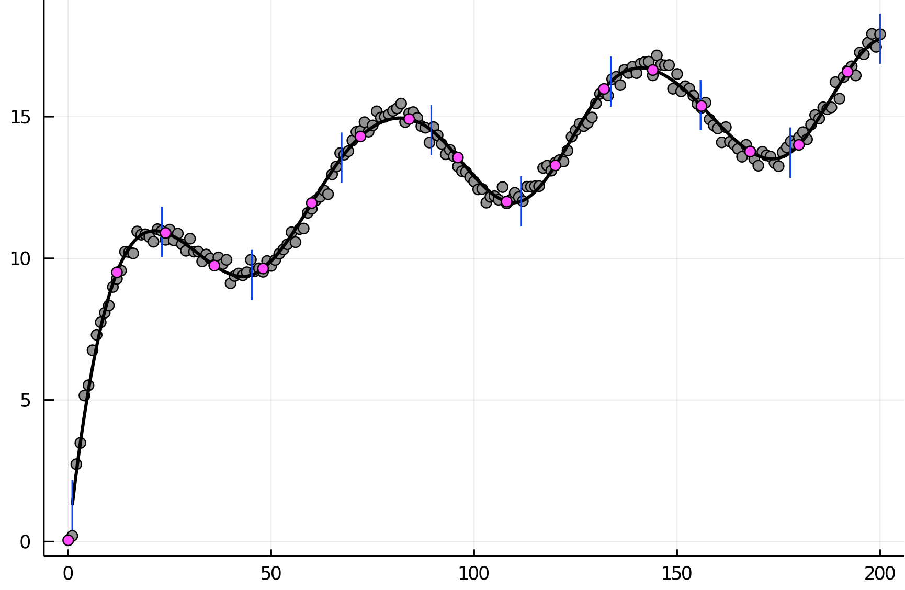
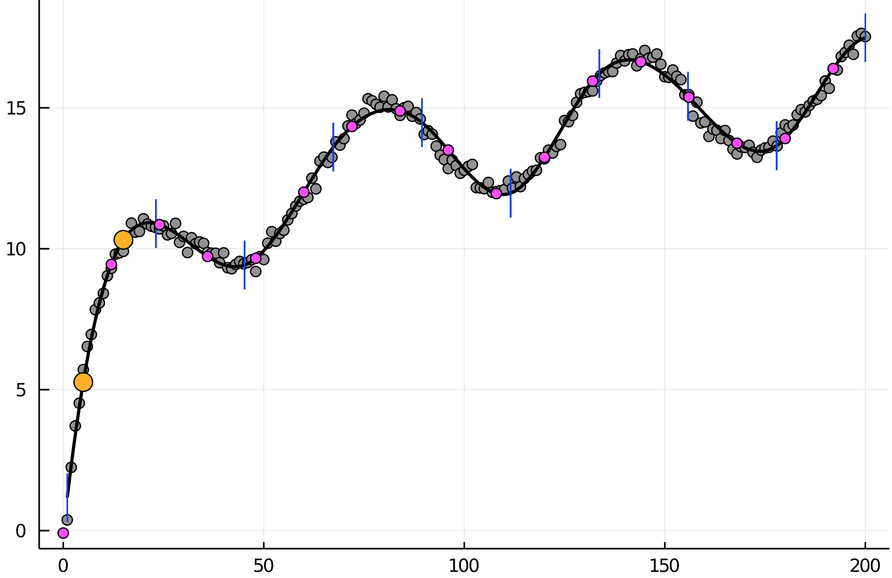

# SplineFit.jl
Function approximation on discrete data and interpolation using cubic splines.


## Example
```julia-repl
x = collect(1:200)
y = 3*log.(x) + 0.2*randn(length(x)) + 2*sin.(x/10)
nSplines = 9
xp = collect(0:12:200)
splineCoeffs, yp = splineFit(x, y, nSplines, xp, curved_ends=true, doplot=true)
```


Using the derived spline function for further interpolation:
```julia-repl
xp2 = [5;15]
yp2 = evalSpline(splineCoeffs, xp2)
scatter!(xp2, yp2, mc=:orange, ms=7)
```




